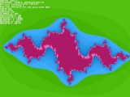
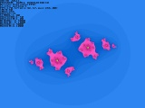
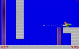

# Old stuff - my 2002-2010 work

Projects writen in Pascal, X86 Assembler, C/C++. Listed in alphabetical order.

## List of projects

### 2D3D (C++, 2008)
In the program, we move around the map, described by vectors in a text file, in a 3D perspective. Drawing is done using a line. Use the 1-5 keys to change the map number, the [Ins] key activates collision detection.

### bmp2h (C, 2008)
The program converts the BMP file into a C / C ++ header file.

### Expr (C/C++ with ASM, 2008-2010)
Interactive calculation program (allows drawing 2D and 3D functions, audio synthesis). Converted to typescript version [here](https://github.com/korolkiewiczk/ExprAE) (not full coverage).

### F_X (Pascal, 2006)
Very simple program in Pascal for drawing functions, optimized for low end computers (like 386 on which it was developed).

### Fontgen (C, 2008)
A program used to generate 8X8 or 8X16 binary character files from standard system fonts.

### fRace (C++, 2008)
A simple simulation of driving a car with a view from above. Maps are created from BMP files by the included mapgen program. Description of the vehicle in a text file. Project unfinished.

### INVAD (ASM, 2009)
A game in assembler under DOS written for about 6 hours: 1014 lines of code and size of binary file is approx 1.7 KB. It contains its own random number generator, delay function or a simulator of moving interstellar dust at different speeds.

### Invaders (C++, 2009)
In the game, we control a space ship and try to survive as long as possible under the invasion of space invaders. The game is written just over 6 hours, it uses OpenGL to display 2D graphics. My own artwork :).

### Julia (C++, 2008)
The program generates fractals from the Julia collection. Uses up to four processors to generate the image.

### Lander (C++, 2007)
The game consists in landing a spaceship on a randomly generated area. With the right / left arrows, change the angle of the ship's inclination to the ground, and with a space we start the string from the engine. Landing will be successful if our speed is not too high and the angle between the ground and our ship is small enough.

### MASM Projects (ASM, 2005)
Here are my various programs (mostly graphic) wrote in assembler and operating in 32-bit mode. Here, among other things, we display scaled images, transparency effects.

### mini DZIAŁO (small GUN) (Pascal, 2002)
My first game - shooting the opponent from the cannon. We set the angle of inclination and the strength of the shot, press the space and ... if we do not hit, we wait what our opponent will do. We have three levels of difficulty to choose from. The game is divided into turns, and each turn consists of two attempts. For variety, the time of day changes at random. An additional difficulty is wind blowing with different strength.

### MLAB (ASM, 2005)
The game consists of passing subsequent labyrinths on time. To make it harder we have to watch out for the red balls moving among the corridors, which always try to turn right. To make it more interesting, we can collect treasures and keys. The number of points depends to a large extent on the time in which we pass the maze. The game is completely written in assembler, works under DOS in 32-bit mode. Unfortunately, as long as the game engine is finished, I created only 3 levels (and in principle 2 entirely). In the attached editor we can create new mazes.

### QRead (Pascal/Delphi, 2004)
Fast reading learning software written in Delphi.

### S3D (Pascal, 2008)
The idea of writing a 3D game based only on sprites (scaled bitmaps, usually some of their fragments are transparent which gives the effect that the picture has a contour) appeared in my head several years earlier. So I decided to implement it, devoting only a few days to the matter. In the game, our task is to shoot objects. Each shot costs 1 point, but we can score several points with one shot. We have an additional bonus for hitting the object that moves. The game includes the editor of the said sprays, objects are randomly arranged.

### Standart (Pascal, 2002)
This time, the idea of writing something in text mode appeared. We are in space and our task is to shoot from the square to the second square, which even dodges. An additional graphic effect is stars randomly changing their location at random. We just have to watch out for the opponent. His accurate shot is the end of the game :( Because the longer we play it is more interesting ... To end the game, press the [q] key.

### Trap (Pascal, 2003-2005)
In this platforme game, you play the guy who, trapped in underground labyrinths, has to get to the underground "residence" of a crazy scientist to save himself and the world. This very ambitious (and as you can see laborious) project unfortunately did not live to see the playable version (we can only move on several levels, shoot, swim, jump, but there are no opponents or a fixed course of action). I admit that I put in this project (so far) the most strength and time, but (here the information for novice programmers) having not yet the highest experience and writing the program without a coherent plan, it turned out that the further development of the project has no prospects, especially that 16-bit, compiled by Turbo Pascal, has too many limitations. Despite this, the program contains a lot of solutions like graphics engine working in SVGA resolutions, a script system and its own format for recording music.

### Tron (Pascal, 2003)
By moving the square texture, we have to reach the end of the maze made of other square textures in order to move to the next level. The end of the map is nowhere marked, but the closer we are to the end, the more the PC-SPEAKER becomes more and more annoying. Fortunately, in the program setup.exe we can change its intensity and generate new mazes at the same time (the generator works completely randomly).

### VECBLOCK (C++, 2006)
I've thought about writing a 3D game before. I finally decided that it is worth taking care of it. I decided, however, to write the engine first and then the game. Unfortunately game was not finished :( One day I overwritten new files with old ones, so morals for further work felt down and I finally gave up the project.

### vfunc (C++, 2009)
Application that allows displaying three-dimensional animated vector function charts.

### WinGraph, WinOpenGL, WinSound (C++, 2008)
Helper frameork for writing games under windows. Threat as dependencies for some of applications listed above.

### x86em (C++, 2007)
An unfinished project of the X86 processor emulator. Ultimately, the program can be used as a simple disassembler.

## Remarks
I wrote programs in the period when I was just gaining experience, which is why code in many places is quite confusing and unreadable. Documentation for programs is written in Polish. I do not provide any support for compiling / building programs.